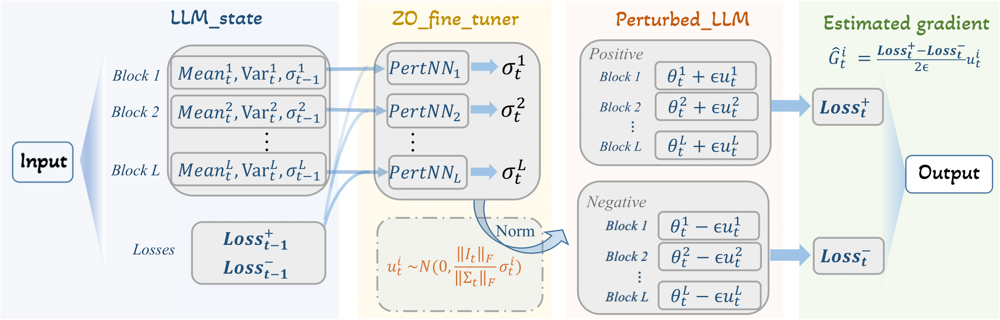

# Learning Based Zero-order Fine-tuning
In this work, we propose ZO Fine-tuner, a learning-based zeroth-order optimizer that automatically learns efficient perturbation strategies through a compact and memory-efficient design. A key insight behind our approach is that only a small number of foundation models are widely adopted in practice—thus, optimizing the optimizer once for a given LLM and reusing it across diverse downstream tasks is both feasible and highly impactful.

We first train the Zeroth‑Order Fine‑Tuner under a learning‑to‑learn framework. The trained fine‑tuner injects adaptive, non‑uniform, block-wise perturbation scales into standard zeroth‑order update rules, enabling high‑performance gradient‑free optimization of the target LLM. 



Experiments on 4 LLMs and 7 datasets show that ZO Fine-tuner outperforms prior zeroth-order baselines in 23/28 of the task-model combinations, achieving an average 2.5% improvement in accuracy compared to MeZO, thereby demonstrating strong performance and scalability for efficient LLM fine-tuning.


## Installation
```bash
conda create -n ZO_fine_tuner python==3.9.19
conda activate ZO_fine_tuner 
pip install -r requirements.txt
```

This environment can support the OPT, LLaMA, Qwen and other recent LLMs.
## Usage

Use `run_l2l.py` to conduct learning to learn and use `run_zo_fune_tuner.py` for zeroth-order fine-tuning with the learned optimizer.
```bash
python run_l2l.py {ARGUMENTS}
python run_zo_fune_tuner.py {ARGUMENTS}
```

We provide example scripts below for reproducing our experiments, for both Learning to Learn and the ZO Fine-Tuner, respectively.
```bash
#learning to learn
WANDB_MODE=disabled CUDA_VISIBLE_DEVICES=0 NEED_NORMALIZATION=True LOAD_FLOAT_16=False LR_MLP=0.1 EPOCH=15  LR_UPDATE=1e-6 TRAIN_MODE='l2l' EPOCHS_PER_RESTART=5 MODEL=meta-llama/Llama-3.2-1B TASK=Copa LR_LLM=0.01  SAVE_MLP_PATH='./learned_finetuner/llama1B_finetuner.pth' bash ./scripts/l2l.sh

# zero-order fine-tuning with the learned optimizer
WANDB_MODE=disabled CUDA_VISIBLE_DEVICES=0 LR=1e-7 LOAD_FLOAT_16=True NEED_NORMALIZATION=True TRAIN_MODE='zo_fine_tuner' STEPS=20000 MODEL=meta-llama/Llama-3.2-1B TASK=SST2 MODE=ft LOAD_MLP_PATH='./learned_finetuner/llama1B_finetuner.pth' bash ./scripts/zo_fine_tuner.sh
```

